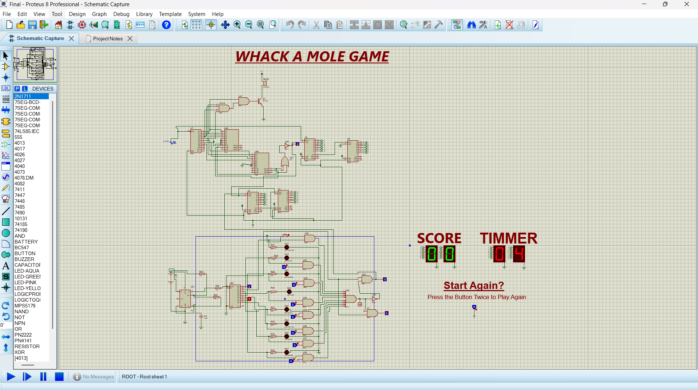

This repository contains the Proteus design files for a digital "Whack-A-Mole" game implemented using discrete logic components. Unlike designs that utilize a single microcontroller IC, this implementation leverages a network of 74xx series logic gates to manage game logic, scorekeeping, and timing. This approach provides a deeper understanding of the underlying digital logic involved in game design. The hardware includes:

Seven-Segment Displays: Two 7-segment displays show the score and timer.

Buttons: A button initiates gameplay and potentially controls the "moles" (not explicitly shown in the schematic).

LEDs: LEDs likely represent the "moles" themselves, indicating which ones are active. The schematic shows LEDs of various colors.

Logic Gates (74xx series): A network of 74xx series logic gates implements the game's core logic, including score counting, timing, and potentially random mole activation. This design showcases the intricate logic required for such a game without the abstraction of a microcontroller and arduino.

Other Components: Other components like resistors, capacitors, and possibly a buzzer are included for proper circuit operation.

The design is fully simulated in Proteus, allowing for testing and verification of the circuit's functionality before physical implementation. The schematic provides a detailed view of the circuit's components and their interconnections.

Features:

Scorekeeping: Tracks the player's score using 7-segment displays.

Timer: Includes a timer to limit gameplay duration, displayed on a 7-segment display.

Game Reset: Allows restarting the game via button press.

Discrete Logic Implementation: This design is a unique example of a game implemented using discrete logic, offering educational value in digital design.

Proteus Simulation: The design is fully simulated in Proteus, making it easy to test and debug.

Here is the ScreenShot of the Implementation

